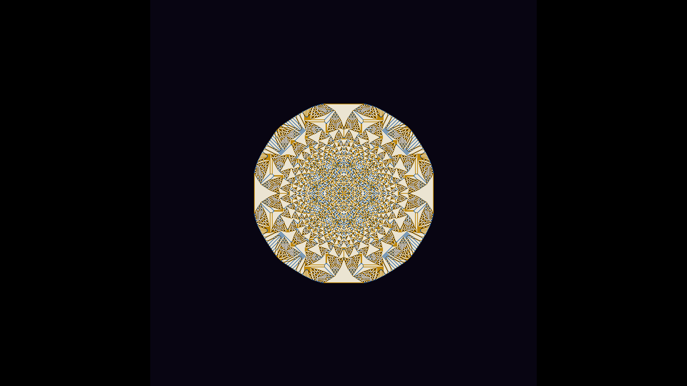

# abelian_sandpile_fractal_growth

## Metadata
- **Date**: 2026-06-08
- **Theme**: The Abelian Sandpile Model is one of the simplest known systems that spontaneously self-organises in
- **Technique**: - Vectorised parallel toppling with `numpy` (no Python loop per cell) - Bit-mask unstable cells, subtract 4 × mask, add 1 to each neighbour with array slicing - `np.zeros` pixel buffer with ARGB layout; written via `py5.load_np_pixels` / `update_np_pixels` - 4× `np.repeat` upscale to 4K
- **Logic Lab Reference**: 

## Concept
The Abelian Sandpile Model is one of the simplest known systems that spontaneously self-organises into a fractal. Starting from a single cell loaded with hundreds of thousands of virtual grains of sand, the model repeatedly applies one rule: any cell holding ≥ 4 grains topples, passing one grain to each of its four cardinal neighbours. This avalanche cascades outward, and the cumulative pattern that emerges is a perfect, self-similar mandala of breath-taking complexity — built entirely from integer arithmetic.

## Technical Details
- **Renderer**: Unknown
- **Simulation**: A 540 × 540 integer grid is seeded at its centre with grains added 175 per frame. After each batch the grid is repeatedly relaxed (toppled) until stable. Four discrete grain-count levels (0–3) are mapped to a four-colour palette:  | Level | Colour | |-------|--------| | 0 | Deep navy `#08051 2` | | 1 | Cobalt blue `#0c509b` | | 2 | Warm amber `#be870a` | | 3 | Ivory cream `#ebe4d2` |  The 540 × 540 grid is rendered with 4× nearest-neighbour upscaling and centred on a 3840 × 2160 canvas (840 px black bars each side), preserving the exact 4-fold symmetry of the chip-firing lattice.
- **Visuals**: | Parameter | Value | |-----------|-------| | Grid size | 540 × 540 | | Grains per frame | 175 | | Duration | ~22 s @ 60 fps | | Final grain count | ~232 400 |
- **Animation**: - **Format**: Animation, ~22 s @ 60 fps - **Resolution**: 3840 × 2160 (4K UHD)
