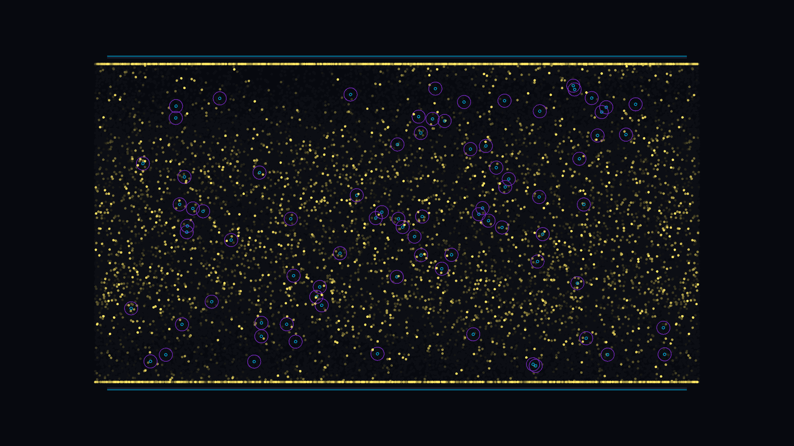

# abrikosov_vortex_depinning

## Metadata
- **Date**: 2026-05-17
- **Theme**: Type-II superconductivity, Abrikosov flux lattice, pinning potential wells, elastic depinning, AC transport current, plastic flow channels
- **Technique**: Overdamped 2D Langevin dynamics for 400 repulsive vortices interacting via a screened Yukawa potential, trapped in an attraction landscape of 80 fixed Gaussian potential wells under an oscillating AC transport drive. Velocity-mapped color styling with persistent, fading long-exposure trails.
- **Logic Lab Reference**: `physics/condensed_matter/abrikosov_vortices.py`

## Concept
*abrikosov_vortex_depinning* explores the kinetic struggle between localized order (flux pinning defects) and collective force (magnetic Lorentz drive) in a quantum superconductor thin film. 

The simulation models 400 quantum vortices (quantized flux tubes) that initially settle into a beautiful, perfect hexagonal Abrikosov crystal lattice. This film is embedded with 80 fixed, random magnetic potential wells representing pinning centers (impurities in the superconducting crystal).

We apply an oscillating horizontal AC transport current, generating an alternating horizontal Lorentz force that drives the vortices left and right. 
- At low drive amplitude, vortices locked inside the pinning centers remain static, vibrating quietly in deep cobalt and electric cyan (#00C3FF) points.
- As the Lorentz force increases, local elastic shear forces build. Suddenly, channels of vortices "depin" and slide, transitioning to a glowing, active magenta/hot pink (#E600B4) hue.
- In zones of high-velocity plastic flow, the vortices unbind completely from the lattice, forming sinuous, roaring "vortex rivers" that shine as brilliant solar gold and glowing white (#FFE664) cores.
- Using a persistent fading trails buffer, these vortex rivers carve permanent, silken, glowing highways of light through the static hexagonal lattice. As the AC current oscillates, the rivers flow, slide, stop, and reverse, resulting in a mesmerizing, pulsating map of quantum transport.

## Technical Details
- **Renderer**: P2D (OpenGL)
- **Simulation**: Vectorized overdamped Langevin dynamics in NumPy with 5 integration substeps per frame ($dt = 0.04$). Pairs experience periodic screened Yukawa repulsion force $F_{rep} = f_0 \cdot e^{-d/\lambda_p}/d$, where $\lambda_p = 55.0$ and $f_0 = 2400.0$. Pinning wells apply smooth, non-singular Gaussian attraction $F_{pin} = -f_{pin} \cdot d \cdot e^{-d^2/r_{pin}^2}$, where $r_{pin} = 28.0$ and $f_{pin} = 750.0$.
- **Boundary Conditions**: Horizontally periodic wrapping in coordinate space. Top and bottom boundaries are constrained by soft elastic repulsion wells ($k_{boundary} = 6.0$) to confine vortices inside the thin film.
- **Visuals**: Long-exposure accumulation buffer (drawing translucent dark overlay instead of clearing background), AC drive-pulsed magnetic pinning well animations, and split horizontal edge drawing for seamless periodic borders.
- **Animation**: 15 seconds at 60 frames per second (900 total frames), compiled into high-fidelity 4K MP4.
