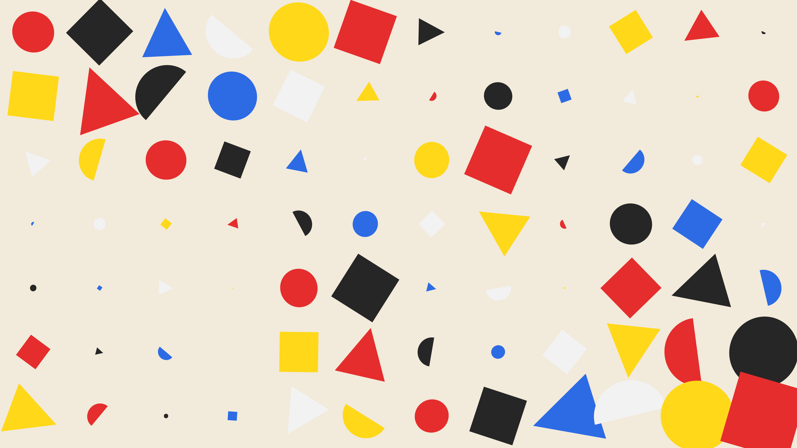

# abstract_bauhaus_geometric_composition_2d

## Metadata
- **Date**: 2026-06-15
- **Theme**: An animated 15s sequence of shifting Bauhaus-style geometric shapes in primary colors, scaled and ro
- **Technique**: Abstract composition using primary geometric forms and clean, minimalist aesthetics. A grid of cells where each cell contains a rotating or shifting shape. The cells scale and shift based on slow-moving Perlin noise (`py5.os_noise`). Different shapes are assigned to different cells, and colors are drawn from a strict Bauhaus palette.
- **Logic Lab Reference**: 

## Concept
An animated 15s sequence of shifting Bauhaus-style geometric shapes in primary colors, scaled and rotated by slow-moving Perlin noise.

## Technical Details
- **Renderer**: Unknown
- **Simulation**: Unknown
- **Visuals**: Unknown
- **Animation**: Unknown
