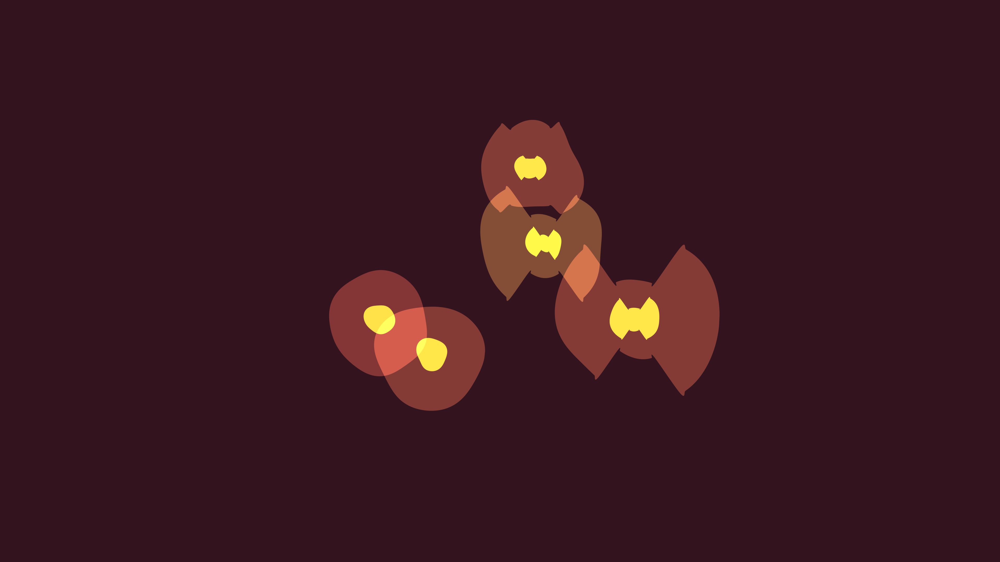

# abstract_biological_cell_division_2d

## Theme
Abstract representation of cellular division (mitosis) in a fluid environment.

## Technique
Soft metaball-like shapes generated using `py5.curve_vertex` and `py5.os_noise`. As time progresses, a sine wave deformation simulates the cell pinching in the middle and stretching apart before division.

## Palette
- Background: Deep maroon
- Dominant: Translucent peach
- Secondary: Soft pink
- Accent: Bright yellow core

## Preview

