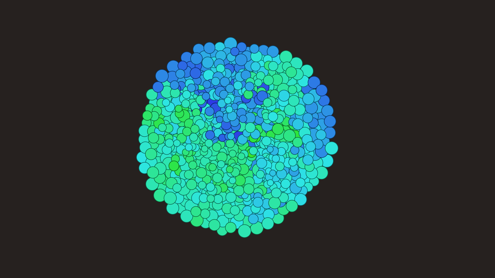

# abstract_cellular_automata_bacterial_growth_2d

An animated 15s sequence of a microscopic view of an abstract bacterial colony expanding. The "bacteria" are small capsules or circles that push each other apart, divide, and change color as they age.

- **Theme**: A microscopic view of an abstract bacterial colony expanding. The "bacteria" are small capsules or circles that push each other apart, divide, and change color as they age.
- **Technique**: Maintains a list of particles (bacteria). Each frame, they repel each other slightly using a spatial physics check. If they reach a certain age, they divide into two, pushing each other apart. Drawn as soft circles with membranes.

