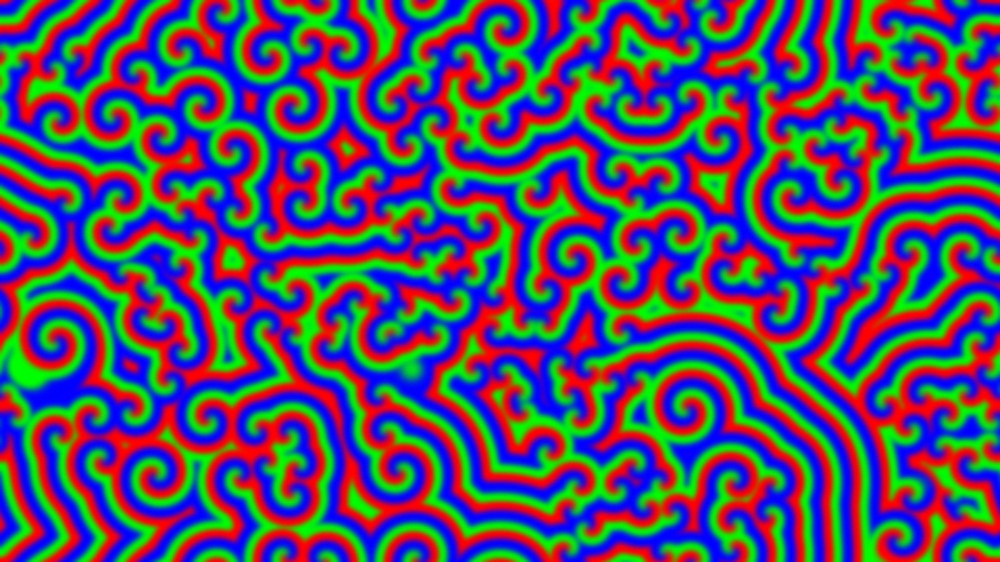

# abstract_cellular_automata_belousov_zhabotinsky_2d

## Metadata
- **Date**: 2026-06-22
- **Theme**: An animated 15s sequence of a continuous Belousov-Zhabotinsky reaction simulation
- **Technique**: Unknown
- **Logic Lab Reference**: 

## Concept
An animated 15s sequence of a continuous Belousov-Zhabotinsky reaction simulation. This creates beautiful scrolling spiral waves of color that behave like a chemical clock.

- **Theme**: A continuous Belousov-Zhabotinsky reaction simulation. This creates beautiful scrolling spiral waves of color that behave like a chemical clock.
- **Technique**: Implements a simplified BZ reaction using a 2D cellular automata grid with 3 states (A, B, C) represented as floats. Each frame diffuses the states and applies the reaction rules. Maps A, B, C to RGB channels for psychedelic swirling patterns. Runs the simulation on a smaller grid and scales it up to 4K for performance.

## Technical Details
- **Renderer**: Unknown
- **Simulation**: Unknown
- **Visuals**: Unknown
- **Animation**: Unknown
