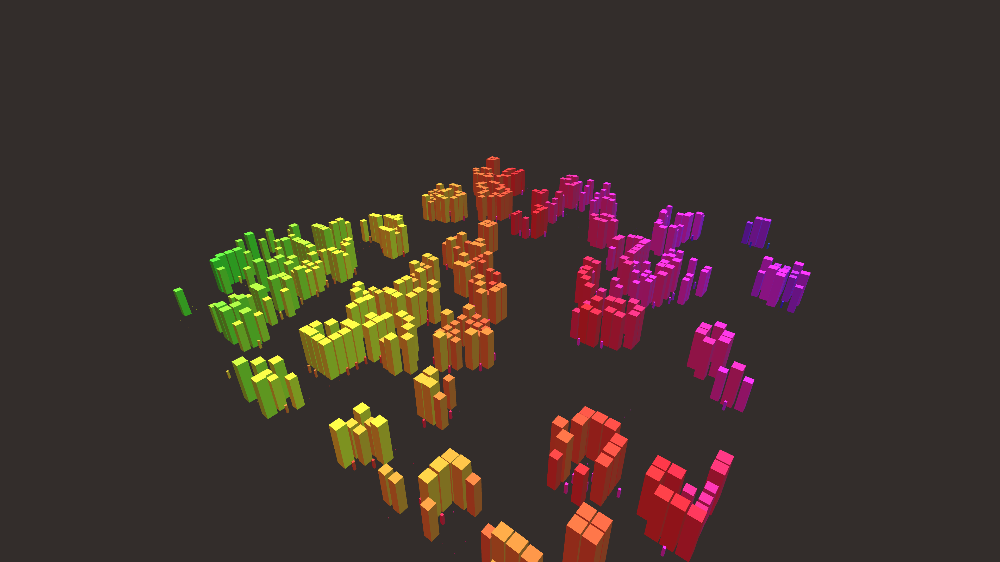

# abstract_cellular_automata_conway_game_of_life_3d

## Metadata
- **Date**: 2026-06-22
- **Theme**: An animated 15s sequence of an animated 3D visualization of Conway's Game of Life on a rotating grid
- **Technique**: Unknown
- **Logic Lab Reference**: 

## Concept
An animated 15s sequence of an animated 3D visualization of Conway's Game of Life on a rotating grid. Instead of drawing it on a plane, we extrude each living cell as a glowing 3D box, and we stack previous generations beneath it or simply make the boxes transition smoothly.

- **Theme**: An animated 3D visualization of Conway's Game of Life on a rotating grid. Instead of drawing it on a plane, we extrude each living cell as a glowing 3D box, and we stack previous generations beneath it or simply make the boxes transition smoothly.
- **Technique**: Implements Conway's Game of Life on a 2D grid. Each cell has an "animation value" (float from 0 to 1) that approaches its current binary state over time. Draws a 3D box at each coordinate where the height and size depend on the animation value. The grid slowly rotates in 3D space with directional lighting.

## Technical Details
- **Renderer**: Unknown
- **Simulation**: Unknown
- **Visuals**: Unknown
- **Animation**: Unknown
