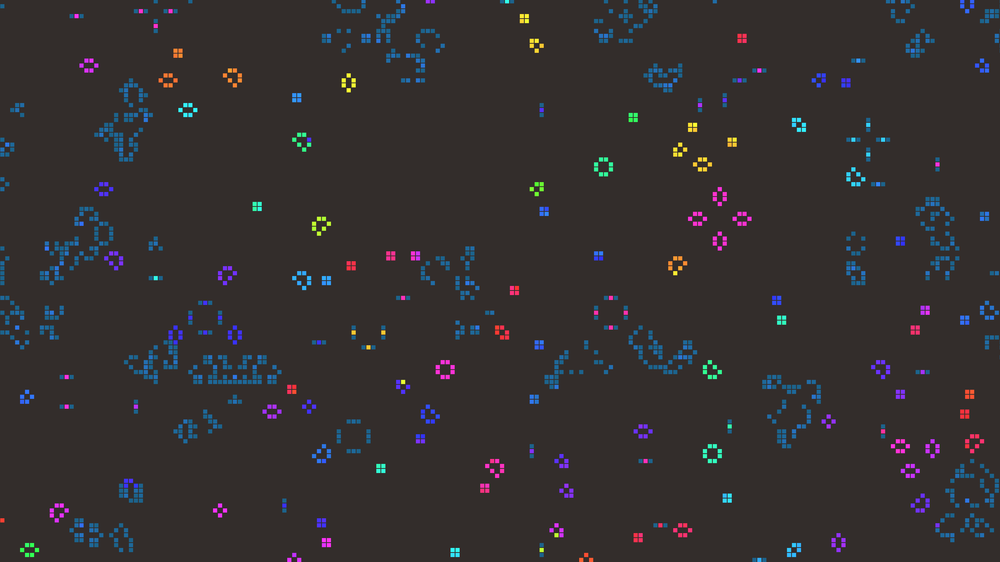

# abstract_cellular_automata_conways_game_of_life_2d

## Metadata
- **Date**: 2026-06-21
- **Theme**: An animated 15s sequence of an aesthetically stylized Conway's Game of Life simulation that zooms ou
- **Technique**: Unknown
- **Logic Lab Reference**: 

## Concept
An animated 15s sequence of an aesthetically stylized Conway's Game of Life simulation that zooms out continuously while cells are born and die, creating complex gliders and still lifes.

- **Theme**: An aesthetically stylized Conway's Game of Life simulation that zooms out continuously while cells are born and die, creating complex gliders and still lifes.
- **Technique**: Maintains a grid of cells. Updates the grid each frame using Conway's rules via fast Numpy operations. Renders the cells with varying hues based on their age, and slowly scales and translates the camera so the view zooms out over time.

## Technical Details
- **Renderer**: Unknown
- **Simulation**: Unknown
- **Visuals**: Unknown
- **Animation**: Unknown
