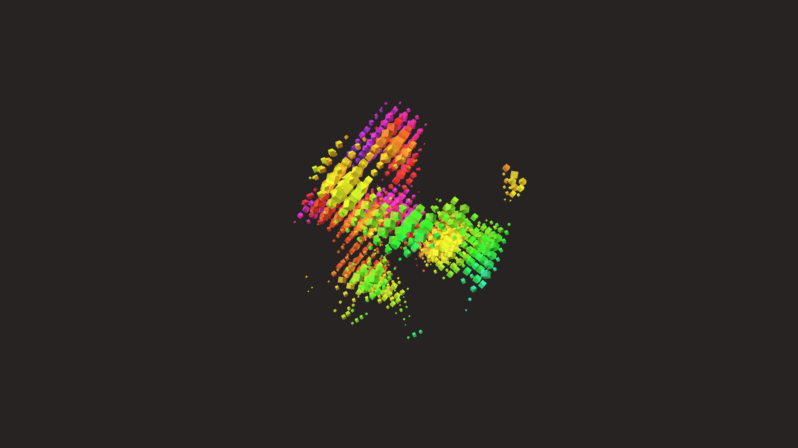

# abstract_cellular_automata_crystals_3d

## Metadata
- **Date**: 2026-06-21
- **Theme**: An animated 15s sequence of a 3D cellular automata system that grows and dies over time, forming geo
- **Technique**: Unknown
- **Logic Lab Reference**: 

## Concept
An animated 15s sequence of a 3D cellular automata system that grows and dies over time, forming geometric crystalline structures that assemble and disassemble in a void.

- **Theme**: A 3D cellular automata system that grows and dies over time, forming geometric crystalline structures that assemble and disassemble in a void.
- **Technique**: A sparse 3D grid where cells are instantiated as Py5 boxes based on a continuous noise threshold instead of discrete rules for visual smoothness. As time progresses, the noise field shifts, causing new crystalline blocks to appear and others to vanish, creating the illusion of a living, evolving geometric structure.

## Technical Details
- **Renderer**: Unknown
- **Simulation**: Unknown
- **Visuals**: Unknown
- **Animation**: Unknown
