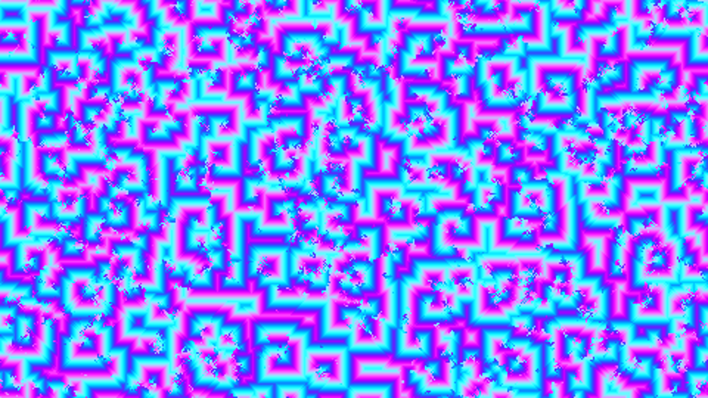

# abstract_cellular_automata_cyclic_2d

An abstract simulation of a cyclic cellular automaton, similar to the Belousov-Zhabotinsky reaction. A grid of cells continuously cycle through a series of states when surrounded by enough neighbors of the next state. This simple rule gives rise to beautiful, self-organizing spiral waves of color that continuously chase each other across the canvas.

## Technical Details

- **Language**: Python + py5
- **Format**: Animation (15s @ 60fps)
- **Renderer**: 2D

## Output

