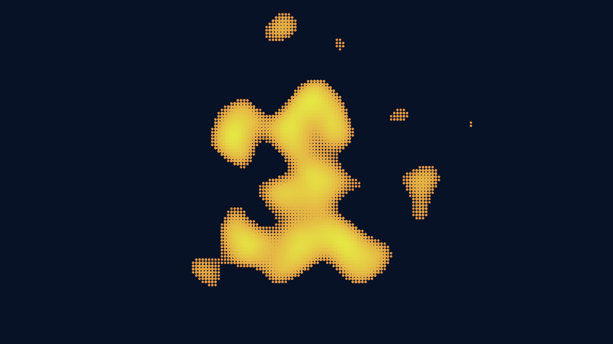

# abstract_cellular_division_organics_2d

## Metadata
- **Date**: 2026-06-21
- **Theme**: An animated 15s sequence of a microscopic, organic look resembling cellular division or petri dish g
- **Technique**: Unknown
- **Logic Lab Reference**: 

## Concept
An animated 15s sequence of a microscopic, organic look resembling cellular division or petri dish growth. Soft, blobby shapes expand, split, and merge with each other over time.

- **Theme**: A microscopic, organic look resembling cellular division or petri dish growth. Soft, blobby shapes expand, split, and merge with each other over time.
- **Technique**: Uses a 2D scalar field evaluated using 3D perlin noise (where Z is time). It thresholds the noise to draw filled shapes. Iterating over a grid, if noise > threshold, it draws a circle, effectively creating a marching-squares-like organic cellular structure.

## Technical Details
- **Renderer**: Unknown
- **Simulation**: Unknown
- **Visuals**: Unknown
- **Animation**: Unknown
