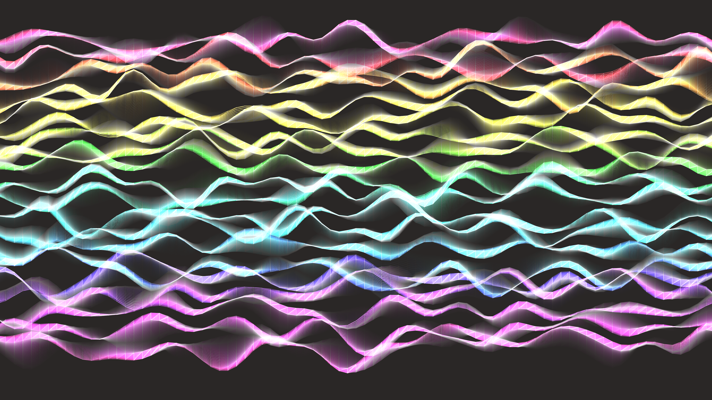

# abstract_chromatic_ribbon_flow_2d

An animated 15s sequence of a 2D generative simulation of smooth, semi-transparent ribbons of vibrant chromatic colors that flow gracefully across the screen, twisting and intertwining like silk in the wind.

- **Theme**: Smooth, semi-transparent ribbons of vibrant chromatic colors flow gracefully across the screen, twisting and intertwining like silk in the wind.
- **Technique**: A series of connected particles moving along complex sine wave paths, drawing continuous ribbons with bezier curves. The ribbons' colors cycle through the HSB spectrum, and their thickness varies based on Perlin noise, creating a 3D depth effect in 2D space.

