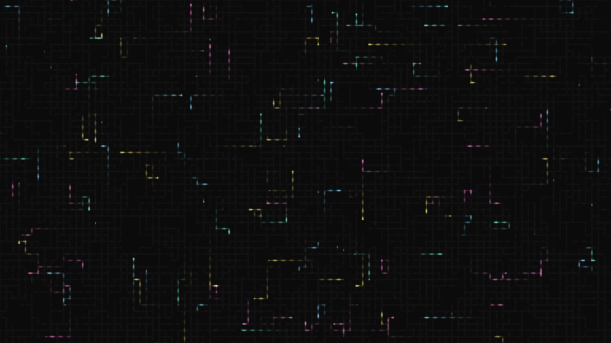

# abstract_cybernetic_circuit_board_maze_2d

## Metadata
- **Date**: 2026-06-21
- **Theme**: An animated 15s sequence of a generative 2D simulation of a digital circuit board
- **Technique**: Unknown
- **Logic Lab Reference**: 

## Concept
An animated 15s sequence of a generative 2D simulation of a digital circuit board. Hundreds of tracers start at random nodes and navigate the grid, turning 90 degrees at random intervals. As they travel, they leave behind glowing paths. 

- **Theme**: A high-tech digital circuit board dynamically drawing neon traces through a complex maze of components, pulsing with light as "data" packets travel across the screen.
- **Technique**: A 2D grid-based random walk algorithm. Hundreds of "tracers" start at random nodes and navigate the grid, turning 90 degrees at random intervals. As they travel, they leave behind glowing paths. Additive blending in a dark background.

## Technical Details
- **Renderer**: Unknown
- **Simulation**: Unknown
- **Visuals**: Unknown
- **Animation**: Unknown
