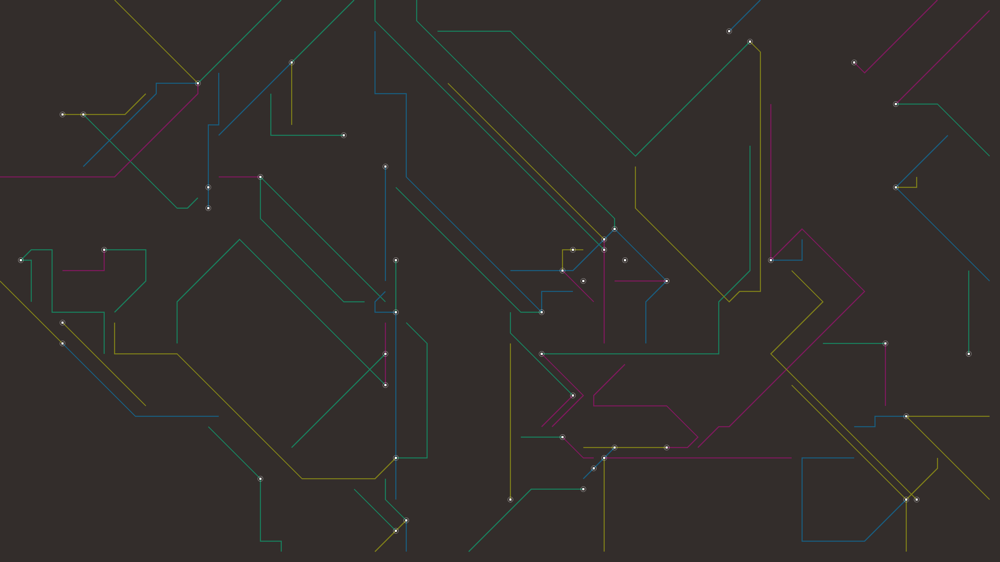

# abstract_cybernetic_circuit_board_routing_2d

An animated 15s sequence of a high-tech circuit board assembling itself. Traces shoot out from nodes, turn at 45 or 90 degree angles, and connect to other nodes. The traces glow with data pulses.

- **Theme**: A high-tech circuit board assembling itself. Traces shoot out from nodes, turn at 45 or 90 degree angles, and connect to other nodes. The traces glow with data pulses.
- **Technique**: Spawns moving agents (traces) on a grid that follow orthogonal and diagonal paths, leaving trails. When traces hit existing paths, they stop. Draws glowing data pulses at the head of each active trace.

