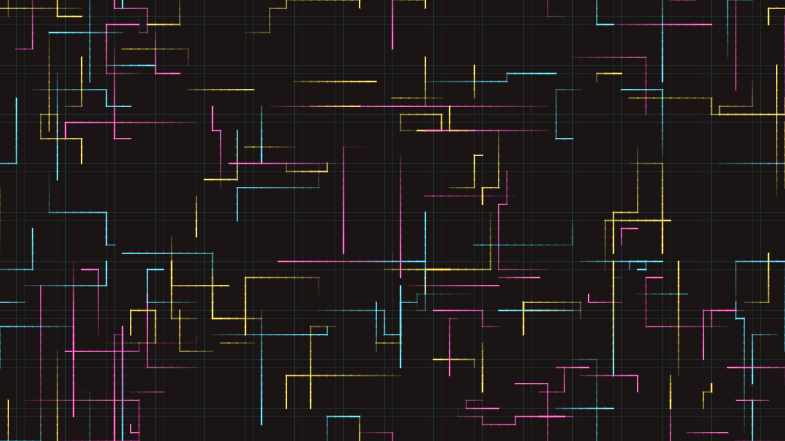

# abstract_cybernetic_circuit_grid_routing_2d

## Metadata
- **Date**: 2026-06-21
- **Theme**: An animated 15s sequence of a high-tech cybernetic circuit board where neon energy pulses travel alo
- **Technique**: Unknown
- **Logic Lab Reference**: 

## Concept
An animated 15s sequence of a high-tech cybernetic circuit board where neon energy pulses travel along a dense grid of orthogonal pathways.

- **Theme**: A high-tech cybernetic circuit board where neon energy pulses travel along a dense grid of orthogonal pathways.
- **Technique**: Spawns pulses that travel along a grid. When they hit an intersection, they turn left, right, or go straight randomly. Draws the background traces dark and the pulses as bright glowing neon segments with a decaying trail.

## Technical Details
- **Renderer**: Unknown
- **Simulation**: Unknown
- **Visuals**: Unknown
- **Animation**: Unknown
