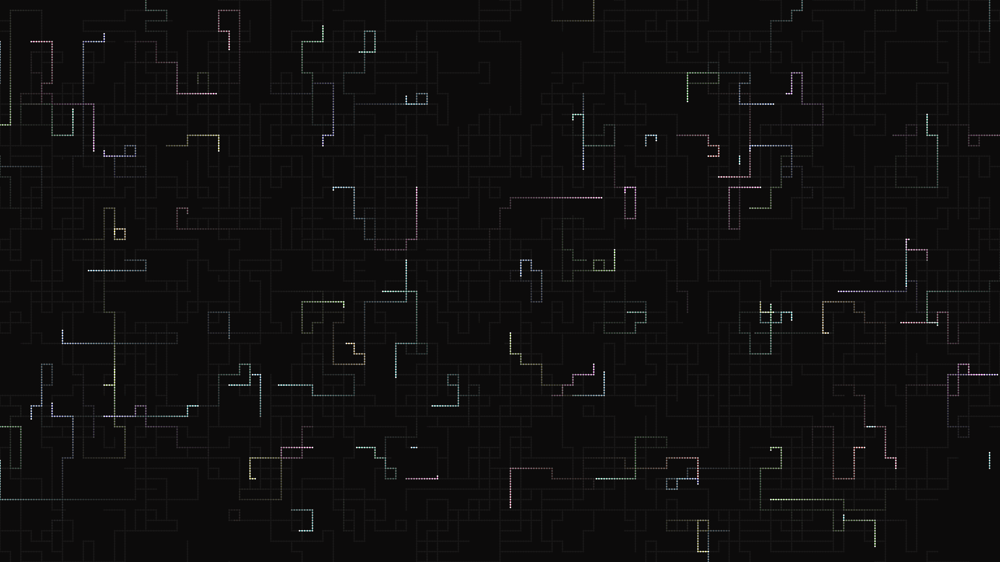

# abstract_cybernetic_circuit_sparks_2d

An animated 15s sequence of a high-speed cybernetic simulation where glowing sparks travel rapidly along a dense network of complex orthogonal circuit traces.

- **Theme**: A high-speed cybernetic simulation where glowing sparks travel rapidly along a dense network of complex orthogonal circuit traces.
- **Technique**: Generates an intricate orthogonal grid path network using active walkers that only turn 90 degrees. These "sparks" leave bright additive fading trails behind them, building a glowing circuit board map as they travel over the 15 seconds.

