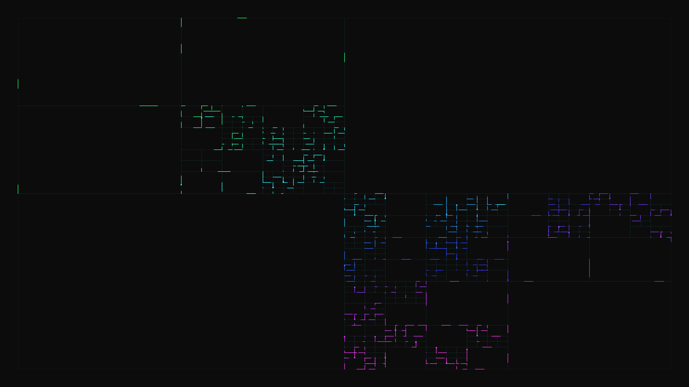

# abstract_cybernetic_fractal_circuitry_2d

Fractal geometry resembling a complex, glowing cybernetic circuit board.

## Details
- **Date**: 2026-06-21
- **Technique**: Recursive subdivision of space using quadtrees, where edges glow with data streams.
- **Format**: Animation (10s @ 60fps)
