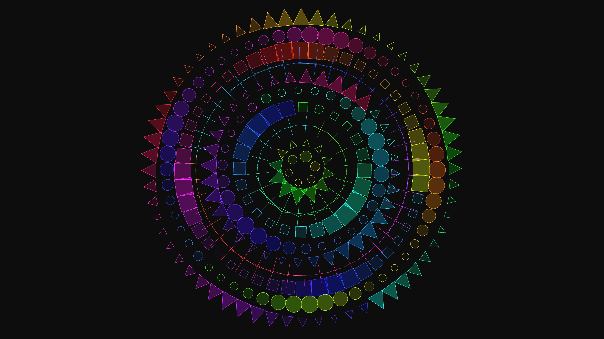

# abstract_cybernetic_mandala_pulse_2d

## Metadata
- **Date**: 2026-06-21
- **Theme**: An animated 15s sequence of a generative 2D cybernetic mandala
- **Technique**: Unknown
- **Logic Lab Reference**: 

## Concept
An animated 15s sequence of a generative 2D cybernetic mandala. Concentric rings of neon geometric shapes expand, contract, and rotate to complex polyrhythms, creating a hypnotic digital pulse.

- **Theme**: A high-tech cybernetic mandala. Concentric rings of neon geometric shapes expand and contract to complex polyrhythms, creating a hypnotic digital pulse.
- **Technique**: 2D procedural generation using polar coordinates, `py5.arc`, `py5.rect`, and `py5.triangle` functions. Complex rotation matrices that shift back and forth mapped to sine/cosine waves of different frequencies.

## Technical Details
- **Renderer**: Unknown
- **Simulation**: Unknown
- **Visuals**: Unknown
- **Animation**: Unknown
