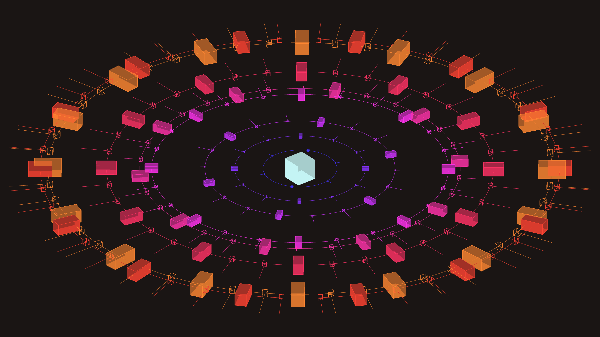

# abstract_cybernetic_mandala_pulse_3d

An animated 15s sequence of a 3D cybernetic mandala floating in a void. Concentric rings of detailed geometry (like glowing circuit traces and abstract tech components) slowly rotate in opposite directions. The geometry pulsates outward to a virtual beat.

- **Theme**: A 3D cybernetic mandala floating in a void. Concentric rings of detailed geometry slowly rotate in opposite directions. The geometry pulsates outward to a virtual beat.
- **Technique**: Using 3D rotations, and drawing complex intersecting arcs, boxes, and lines arranged radially. The radius and scale of components throb rhythmically based on `py5.sin(frame_count)`. It uses an isometric camera projection to make it look like a technical schematic.

