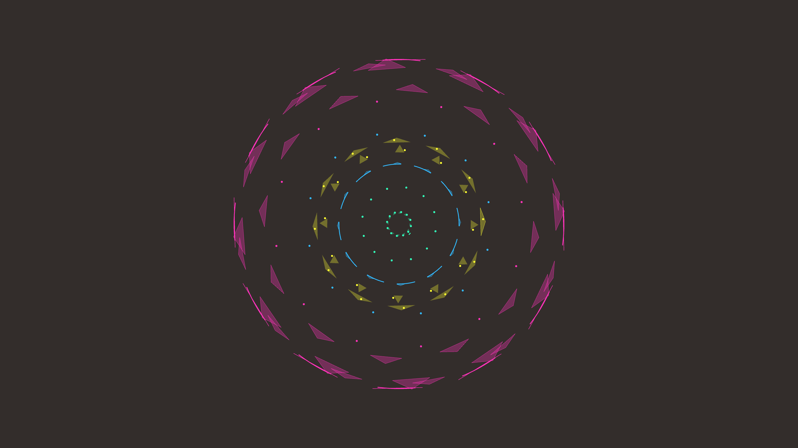

# abstract_cybernetic_mandala_tessellation_2d

## Metadata
- **Date**: 2026-06-21
- **Theme**: An animated 15s sequence of a cybernetic mandala
- **Technique**: Unknown
- **Logic Lab Reference**: 

## Concept
An animated 15s sequence of a cybernetic mandala. Geometric shapes rotating and interlocking in perfect symmetry, but styled like neon glowing HUD elements instead of traditional patterns.

- **Theme**: A cybernetic mandala. Geometric shapes rotating and interlocking in perfect symmetry, but styled like neon glowing HUD elements instead of traditional patterns.
- **Technique**: Builds concentric layers of geometry. Draws a single complex wedge of the mandala and repeats it 12 times radially using `py5.rotate`. Over time, the layers rotate in opposite directions and pulse with neon colors.

## Technical Details
- **Renderer**: Unknown
- **Simulation**: Unknown
- **Visuals**: Unknown
- **Animation**: Unknown
