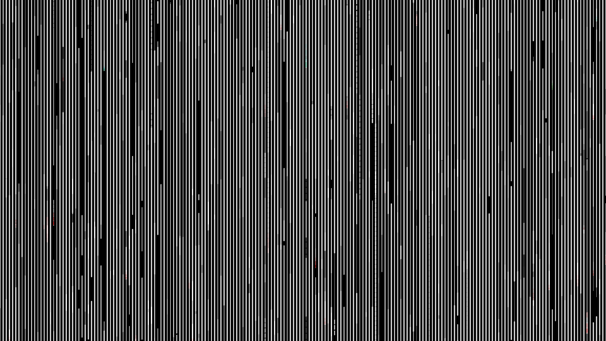

# abstract_cybernetic_neon_data_stream_2d

## Metadata
- **Date**: 2026-06-21
- **Theme**: An animated 15s sequence of a high-speed, vertical "Matrix-style" data stream
- **Technique**: Unknown
- **Logic Lab Reference**: 

## Concept
An animated 15s sequence of a high-speed, vertical "Matrix-style" data stream. Glowing bars of varying lengths drop down the screen at different speeds, leaving trails behind them. They occasionally branch or glitch.

- **Theme**: A high-speed, vertical "Matrix-style" data stream, but abstract. Glowing bars of varying lengths drop down the screen at different speeds, leaving trails behind them. They occasionally branch or glitch.
- **Technique**: Creates a `DataDrop` class that manages a vertical line segment dropping down. As it drops, it occasionally glitches left or right and flashes red. Uses a motion blur effect (drawing a low alpha black rectangle over the screen each frame instead of `py5.background()`).

## Technical Details
- **Renderer**: Unknown
- **Simulation**: Unknown
- **Visuals**: Unknown
- **Animation**: Unknown
