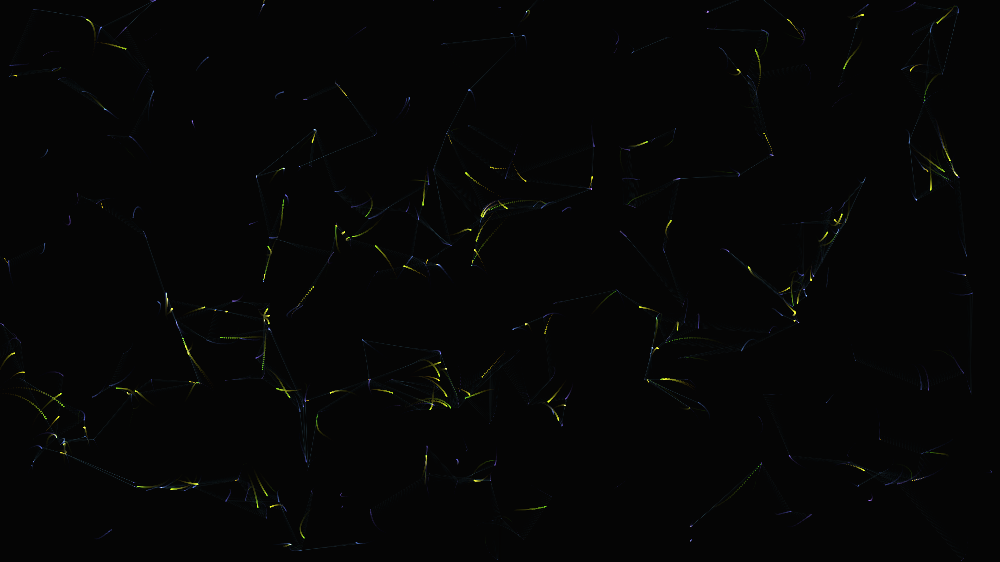

# abstract_cybernetic_neural_network_2d

A representation of an abstract, cybernetic neural network. Glowing data signals pulse and travel along synaptic pathways between drifting nodes. Faint connections randomly form and reform as the structure floats, creating an organic, liquid-like data visualization using additive blending.

## Technical Details

- **Language**: Python + py5
- **Format**: Animation (15s @ 60fps)
- **Renderer**: 2D

## Output

