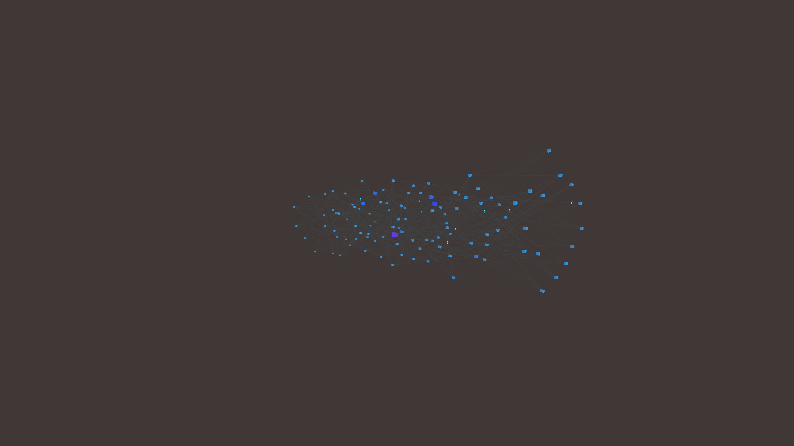

# abstract_cybernetic_neural_network_activation_3d

An animated 15s sequence of an animated 3D visualization of a neural network activation. Nodes connected by edges flash as "data" pulses through them.

- **Theme**: An animated 3D visualization of a neural network activation. Nodes connected by edges flash as "data" pulses through them.
- **Technique**: Generates a 3D graph of nodes and edges in layers. Particles travel along the edges from the input layer to the output layer, activating nodes and causing them to pulse and glow brightly. 

