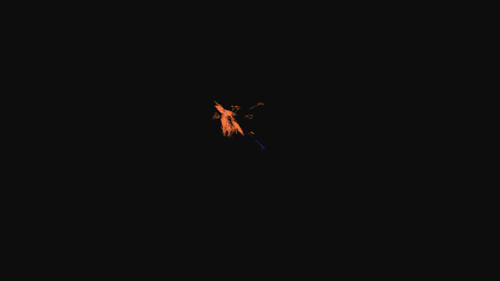

# abstract_cybernetic_particle_swarm_optimization_3d

## Metadata
- **Date**: 2026-06-22
- **Theme**: An animated 15s sequence of an animated 3D visualization of a particle swarm optimization algorithm
- **Technique**: Unknown
- **Logic Lab Reference**: 

## Concept
An animated 15s sequence of an animated 3D visualization of a particle swarm optimization algorithm. A swarm of particles searches for a moving global optimum in a 3D noise landscape, leaving glowing trails as they move.

- **Theme**: An animated 3D visualization of a particle swarm optimization algorithm. A swarm of particles searches for a moving global optimum in a 3D noise landscape, leaving glowing trails as they move.
- **Technique**: Implements the classic PSO (Particle Swarm Optimization) algorithm in 3D. Each particle remembers its personal best position and is drawn towards both it and the global best position. The fitness landscape is dynamically generated using `py5.os_noise`, making the global optimum constantly shift in 3D space.

## Technical Details
- **Renderer**: Unknown
- **Simulation**: Unknown
- **Visuals**: Unknown
- **Animation**: Unknown
