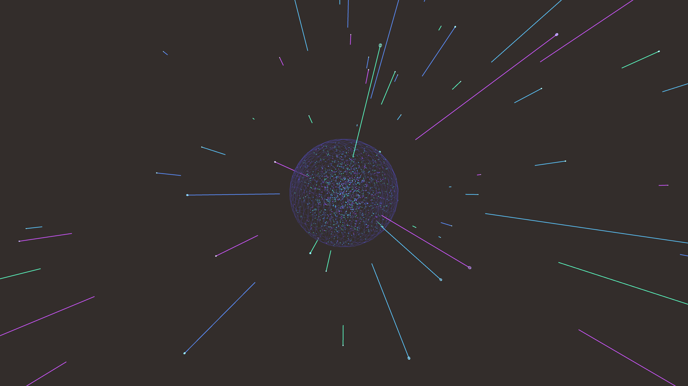

# abstract_cybernetic_quantum_tunneling_particles_3d

## Metadata
- **Date**: 2026-06-22
- **Theme**: An animated 15s sequence of an abstract visualization of quantum tunneling
- **Technique**: Unknown
- **Logic Lab Reference**: 

## Concept
An animated 15s sequence of an abstract visualization of quantum tunneling. Particles are trapped in a potential well (a glowing torus or cylinder) and occasionally "tunnel" out, shooting away with high energy trails.

- **Theme**: An abstract visualization of quantum tunneling. Particles are trapped in a potential well (a glowing torus or cylinder) and occasionally "tunnel" out, shooting away with high energy trails.
- **Technique**: Generates a central potential well using `py5.sphere` drawn as a transparent surface. A large number of particles bounce around inside the well. Each frame, they have a small probability of tunneling outside the well and flying away in random directions, leaving glowing, thick trails.

## Technical Details
- **Renderer**: Unknown
- **Simulation**: Unknown
- **Visuals**: Unknown
- **Animation**: Unknown
