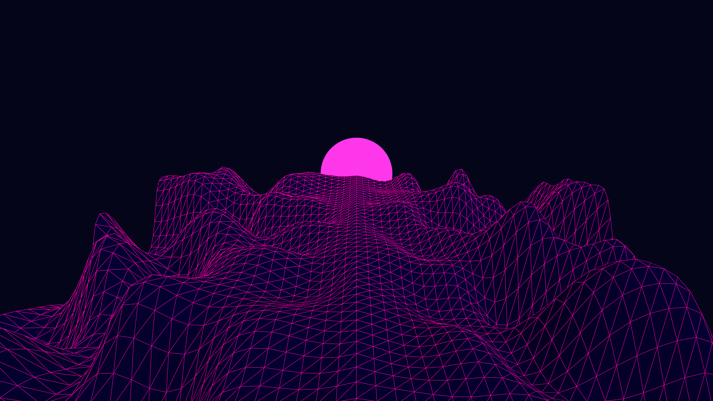

# abstract_cybernetic_wireframe_landscape_3d

## Metadata
- **Date**: 2026-06-21
- **Theme**: An animated 15s sequence of a retro-futuristic wireframe landscape, simulating an endless flight ove
- **Technique**: Unknown
- **Logic Lab Reference**: 

## Concept
An animated 15s sequence of a retro-futuristic wireframe landscape, simulating an endless flight over a neon grid mountain range.

- **Theme**: A retro-futuristic wireframe landscape, simulating an endless flight over a neon grid mountain range.
- **Technique**: Generates a 2D array of heights using Perlin noise. The camera moves forward through the grid by shifting the "z" offset of the noise over time. Draws the terrain as a triangle strip using `py5.begin_shape(py5.TRIANGLE_STRIP)` with a neon pink wireframe and a synthwave sun in the background.

## Technical Details
- **Renderer**: Unknown
- **Simulation**: Unknown
- **Visuals**: Unknown
- **Animation**: Unknown
