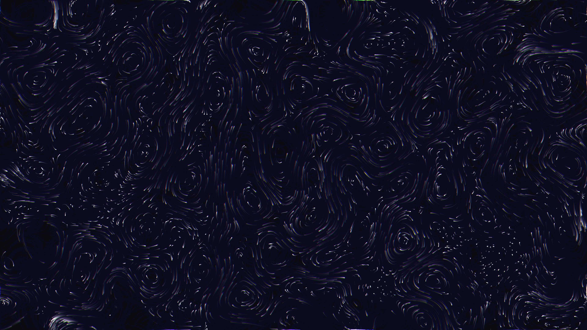

# abstract_fluid_chromatic_aberration_vortices_2d

## Metadata
- **Date**: 2026-06-27
- **Theme**: An animated sequence simulating dense fluid vortices that swirl and merge
- **Technique**: Unknown
- **Logic Lab Reference**: 

## Concept
An animated sequence simulating dense fluid vortices that swirl and merge. To create a hallucinatory liquid effect, a 2D vector field is derived from curl noise, and particles are drawn sequentially with strong simulated chromatic aberration (RGB color channel splitting).

## Technical Details
- **Renderer**: Unknown
- **Simulation**: Unknown
- **Visuals**: Unknown
- **Animation**: 
