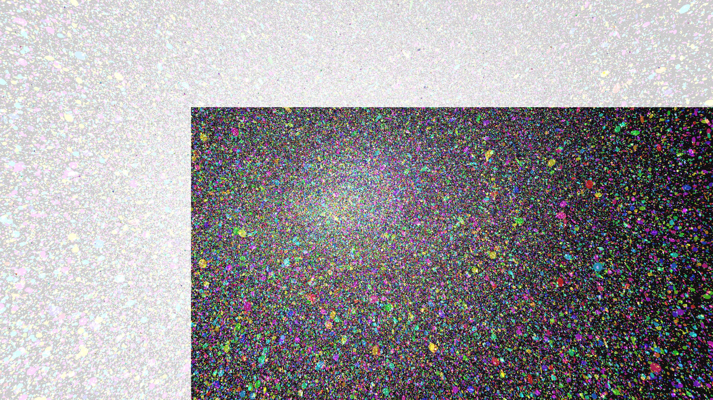

# abstract_fluid_chromatic_vortices_3d

An animated 15s sequence of a generative 3D simulation of swirling chromatic vortices. Thousands of neon particles are drawn into a complex rotating orbital field, leaving trails as they shift through a rainbow color palette.

- **Theme**: A swirling, high-density field of neon chromatic particles caught in rotating 3D vortices. As the particles spiral inward, they change colors forming a vibrant, abstract fluid-like simulation.
- **Technique**: A large number of 3D particles updating their positions using multiple overlapping sine and cosine waves to create a vortex effect, mapped to a rainbow color palette with trails enabled by partial background clearing.

