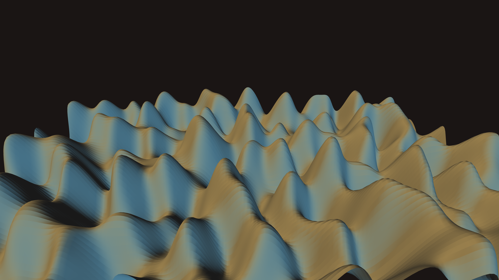

# abstract_fluid_metallic_flow_3d

An animated 15s sequence of a swirling, metallic liquid surface (like liquid mercury or gold). Waves of varying heights reflect lights, creating a highly dynamic organic texture.

- **Theme**: A swirling, metallic liquid surface (like liquid mercury or gold). Waves of varying heights reflect lights, creating a highly dynamic organic texture.
- **Technique**: Generates a dense 3D grid of vertices. The Z-coordinate of each vertex is displaced by 3D perlin noise. Uses `py5.ambient_light()`, `py5.directional_light()`, and `py5.specular()` to make the surface look shiny and metallic.

