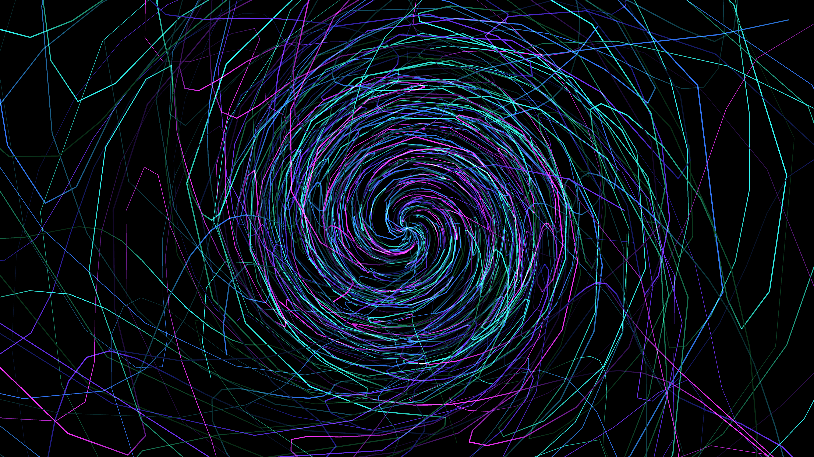

# abstract_fluid_optical_fiber_interference_3d

## Metadata
- **Date**: 2026-06-22
- **Theme**: An animated 15s sequence of an abstract visualization resembling the interior of fiber optic cables
- **Technique**: Unknown
- **Logic Lab Reference**: 

## Concept
An animated 15s sequence of an abstract visualization resembling the interior of fiber optic cables. Glowing strands flow longitudinally in 3D, bending and twisting gently while interference patterns travel down them.

- **Theme**: An abstract visualization resembling the interior of fiber optic cables. Glowing strands flow longitudinally in 3D, bending and twisting gently while interference patterns travel down them.
- **Technique**: Generates multiple 3D curves running along the Z axis. Animates a camera moving through the strands over time to create a tunnel effect. Uses OpenSimplex noise to make the strands twist and uses a sine wave pulse for interference lighting patterns along the length of the strands.

## Technical Details
- **Renderer**: Unknown
- **Simulation**: Unknown
- **Visuals**: Unknown
- **Animation**: Unknown
