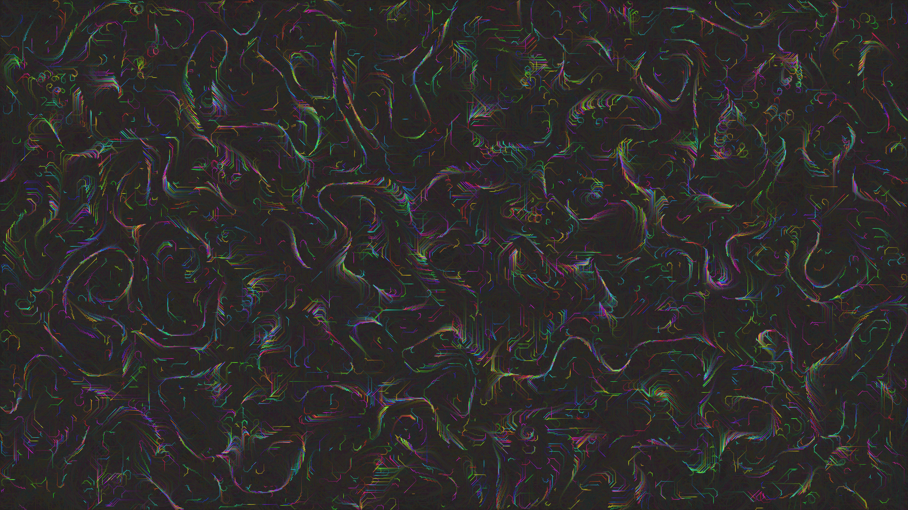

# abstract_fluid_optical_flow_glitch_2d

An animated 15s sequence of a glitch art inspired piece where multiple layers of noise drive pixel displacement to create an optical flow effect, simulating melting or smearing of bright chromatic colors.

- **Theme**: A glitch art inspired piece where multiple layers of noise drive pixel displacement to create an optical flow effect, simulating melting or smearing of bright chromatic colors.
- **Technique**: Uses thousands of tiny semi-transparent particles that leave trails, driven by a vector field (flow field). The vector field changes over time and has sharp angular constraints to give a "glitchy" digital look instead of purely smooth organic curves.

