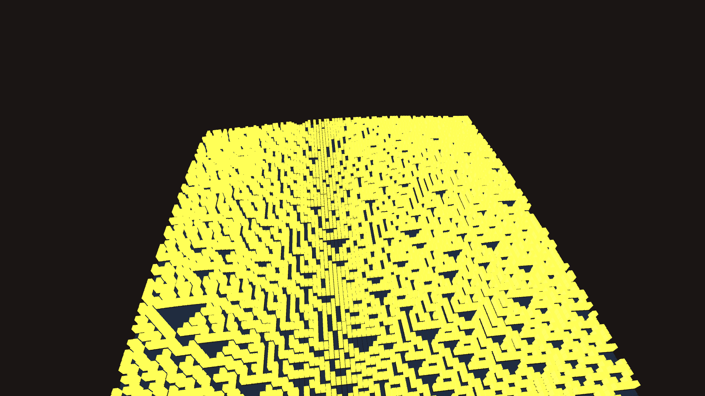

# abstract_generative_cellular_automata_1d

A breathtaking digital tapestry weaves itself in real-time. Rendered in a deep, moody isometric 3D view, a chaotic but highly structured pattern cascades downward like a waterfall. 

The pattern is built from thousands of individual geometric blocks—glowing, metallic gold pillars representing "alive" cells, and dark obsidian blocks representing "dead" cells. The chaotic geometry of Rule 30 creates striking triangle patterns that slide gracefully across the screen as the entire woven structure slowly rotates in three-dimensional space.
