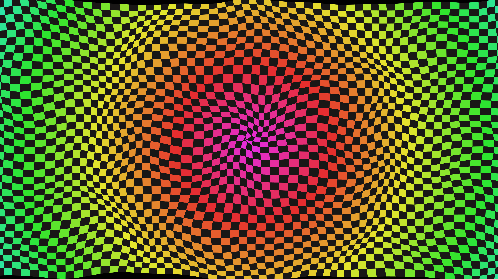

# abstract_generative_op_art_checkerboard_2d

An optical illusion checkerboard that distorts, twists, and waves over time.

## Details
- **Date**: 2026-06-21
- **Technique**: Drawing a dense grid of quadrilaterals whose vertices are displaced by 2D Perlin noise and sine waves.
- **Format**: Animation (10s @ 60fps)
