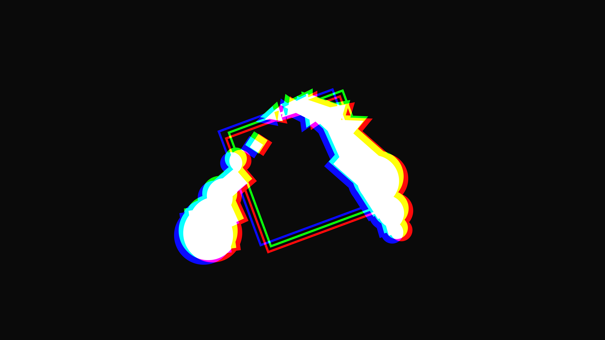

# abstract_geometric_chromatic_aberration_2d

## Metadata
- **Date**: 2026-06-21
- **Theme**: Geometric shapes colliding and separating with intense RGB color shifting (chromatic aberration effe
- **Technique**: Unknown
- **Logic Lab Reference**: 

## Concept
Geometric shapes colliding and separating with intense RGB color shifting (chromatic aberration effect).

## Technical Details
- **Renderer**: Unknown
- **Simulation**: Unknown
- **Visuals**: Unknown
- **Animation**: Contains animation details
