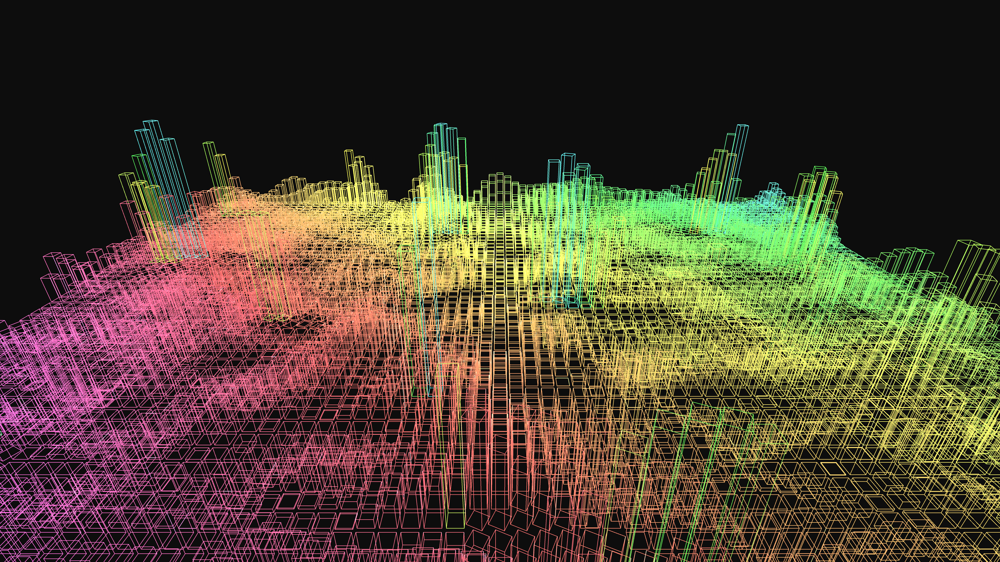

# abstract_geometric_cityscape_wireframe_3d

An animated 15s sequence of a generative 3D simulation of a high-tech futuristic city. Visualized as glowing 3D wireframe buildings that grow, shrink, and pulse to an unseen rhythm, with a camera flying over the abstract metropolis.

- **Theme**: A high-tech futuristic city visualized as glowing 3D wireframe buildings that grow, shrink, and pulse to an unseen rhythm, with a camera flying over the abstract metropolis.
- **Technique**: A grid of 3D boxes with `py5.no_fill()` and neon strokes, whose heights are determined by 3D Perlin noise. The camera moves continuously across the grid to simulate flight. Additive blending in a dark background.

