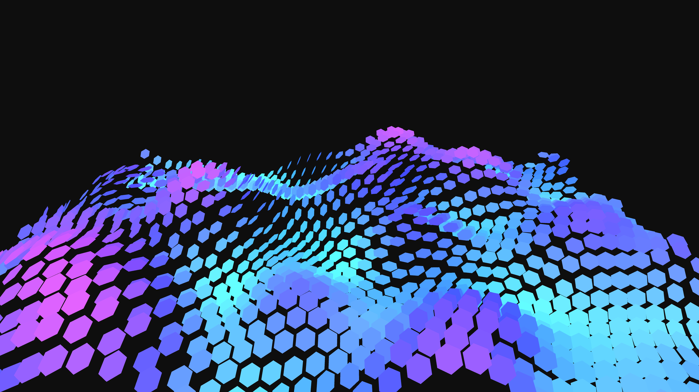

# abstract_geometric_hexagonal_grid_folding_3d

An animated 15s sequence of an animated 3D grid of hexagons that fold up and down like origami or a mechanical surface.

- **Theme**: An animated 3D grid of hexagons that fold up and down like origami or a mechanical surface.
- **Technique**: Generates a hexagonal grid in 3D. The center of each hexagon moves up/down in Z based on OpenSimplex noise. Individual hexagons tilt based on a 2D noise field. Rendered with directional lighting and shiny materials, it looks like a mechanical or futuristic folding surface.

