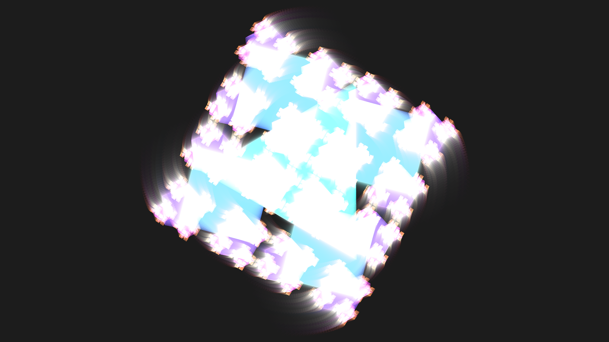

# abstract_geometric_kaleidoscope_fractal_2d

An animated 15s sequence of an intricate, constantly shifting geometric kaleidoscope that branches into smaller repeating shapes, creating a fractal-like illusion.

- **Theme**: An intricate, constantly shifting geometric kaleidoscope that branches into smaller repeating shapes, creating a fractal-like illusion.
- **Technique**: A recursive drawing algorithm that generates a 2D radial symmetry pattern. As time passes, the angles, sizes, and depth of recursion slowly change based on overlapping sine waves. The blending mode ensures colors overlap dynamically.

