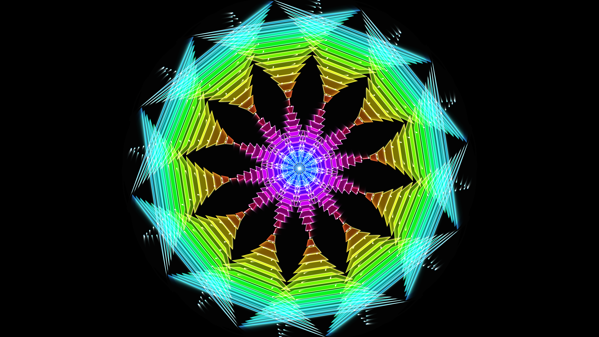

# abstract_geometric_kaleidoscope_mandala_2d

A glowing, neon kaleidoscope of rotating geometric shapes. A single mutating slice of sine-wave driven geometry is duplicated and mirrored recursively around the center of the canvas. Rendered with additive blending, the intersecting lines create a dense, pulsing mandala of light.

## Technical Details

- **Language**: Python + py5
- **Format**: Animation (15s @ 60fps)
- **Renderer**: 2D

## Output

