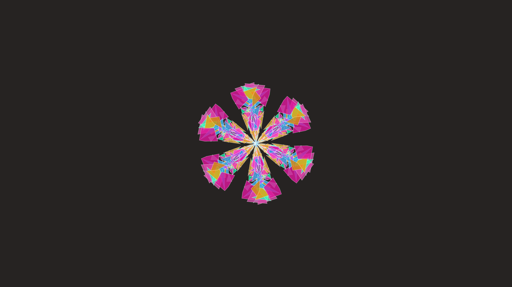

# abstract_geometric_kaleidoscope_shatter_2d

An animated 15s sequence of a kaleidoscope made of shattered geometric glass shards that constantly rotate, reflect, and re-arrange themselves.

- **Theme**: A kaleidoscope made of shattered geometric glass shards that constantly rotate, reflect, and re-arrange themselves.
- **Technique**: Generates a set of random polygons (shards). Draws them in a central slice. Uses a loop to apply rotational symmetry `py5.rotate(angle)` and reflect the drawing to create a kaleidoscope effect.

