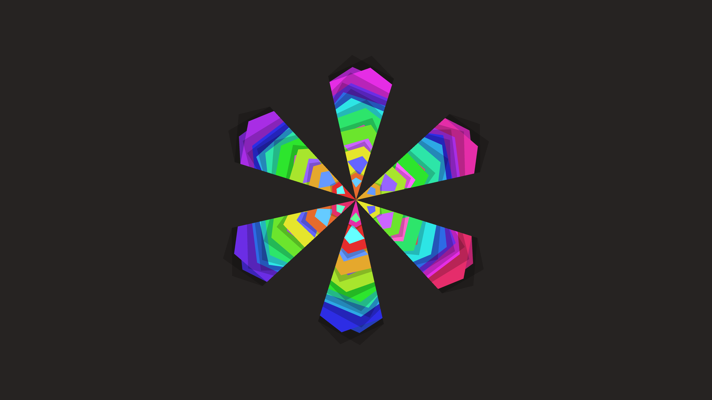

# abstract_geometric_mandala_tessellation_2d

An animated 15s sequence of a flat, 2D interlocking geometric tessellation that continuously morphs and spins like a complex optical illusion mandala.

- **Theme**: A flat, 2D interlocking geometric tessellation that continuously morphs and spins like a complex optical illusion mandala.
- **Technique**: Divides the screen radially. Inside each radial segment, it draws a mirrored polygonal tessellation pattern. As time progresses, the radii, angles, and colors of the polygons shift using sine waves, creating a kaleidoscopic breathing effect.

