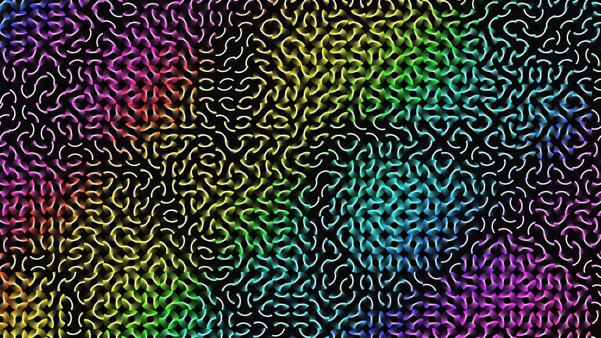

# abstract_geometric_truchet_tiling_2d

An animated labyrinth of Truchet tiles that continuously shape-shifts. The canvas is divided into a grid, with each cell drawing arcs that connect its edges. A slow-moving noise field sweeps across the canvas, smoothly rotating each tile to form an ever-changing maze of glowing paths that fade over time.

## Technical Details

- **Language**: Python + py5
- **Format**: Animation (15s @ 60fps)
- **Renderer**: 2D

## Output

