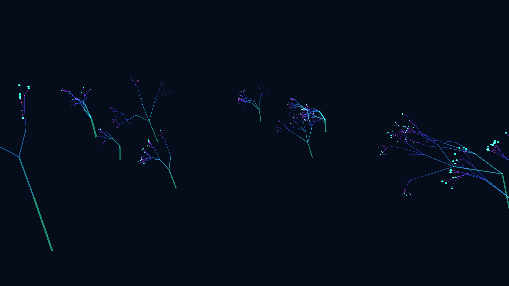

# abstract_luminescent_coral_reef_3d

## Metadata
- **Date**: 2026-06-21
- **Theme**: An animated 15s sequence of a generative 3D coral reef
- **Technique**: Unknown
- **Logic Lab Reference**: 

## Concept
An animated 15s sequence of a generative 3D coral reef. The recursive branches sway with 3D Perlin noise and the tips glow brightly, simulating translucent bioluminescent corals swaying in an ocean current.

- **Theme**: A glowing, ethereal coral reef simulation where polyps pulse and sway.
- **Technique**: 3D recursive branching using cylinders and spheres, governed by a 3D Perlin noise vector field for swaying, with additive blending and neon color maps.

## Technical Details
- **Renderer**: Unknown
- **Simulation**: Unknown
- **Visuals**: Unknown
- **Animation**: Unknown
