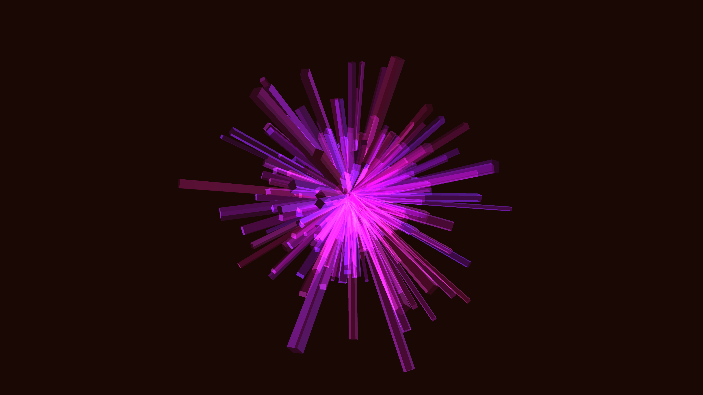

# abstract_luminescent_crystal_growth_3d

## Metadata
- **Date**: 2026-06-21
- **Theme**: An animated 15s sequence of a generative 3D simulation of crystal growth
- **Technique**: Unknown
- **Logic Lab Reference**: 

## Concept
An animated 15s sequence of a generative 3D simulation of crystal growth. Polygons forming luminescent crystals grow outward from a central mass, dynamically refracting a rotating light source.

- **Theme**: Crystals growing from a central mass outward, refracting a light source.
- **Technique**: Procedurally generated 3D polygonal crystals using Fibonacci sphere point generation for even distribution. The size and length of crystals change over time with sine-based growth patterns, and a dynamic point light source rotates around them to create specular highlights and depth. Additive blending with neon purple/pink colors.

## Technical Details
- **Renderer**: Unknown
- **Simulation**: Unknown
- **Visuals**: Unknown
- **Animation**: Unknown
