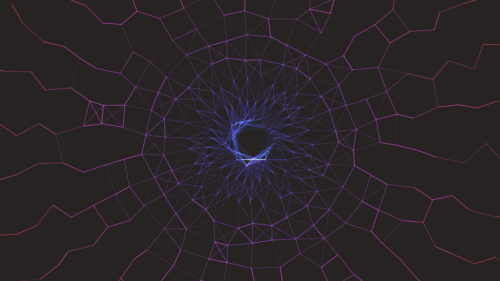

# abstract_luminescent_geometric_spiderweb_2d

An animated 15s sequence of an endless zooming view into a luminescent, infinitely complex spiderweb. The web geometry builds radially and connects points randomly with glowing neon lines.

- **Theme**: An endless zooming view into a luminescent, infinitely complex spiderweb. The web geometry builds radially and connects points randomly with glowing neon lines.
- **Technique**: Keeps an array of points forming a web. Over time, it uses scaling to slowly zoom into the center. It draws lines between points based on proximity using additive blending to create a glowing effect.

