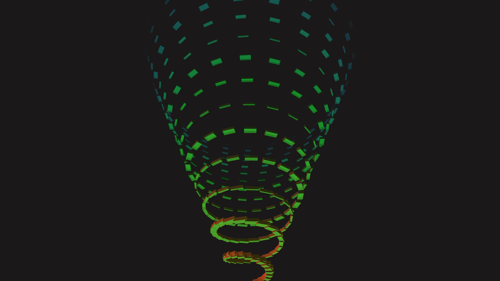

# abstract_luminescent_geometric_spiral_3d

An animated 15s sequence of a 3D glowing spiral staircase structure that continuously unwinds. The structure is built of glowing cubes that fade out as they travel upwards.

- **Theme**: A 3D glowing spiral staircase structure that continuously unwinds. The structure is built of glowing cubes that fade out as they travel upwards.
- **Technique**: Iterates over an array of boxes, calculating their angle, radius, and height based on their index. Uses the frame count to offset their index to create an infinite loop. Boxes pulse in width based on a sine wave.

