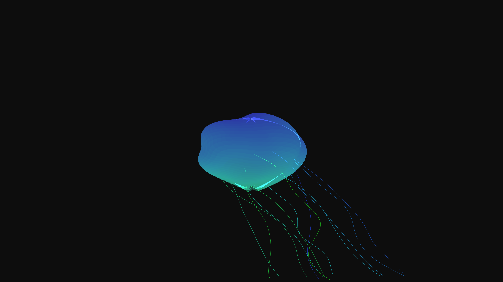

# abstract_luminescent_jellyfish_geometry_3d

A glowing, ethereal structure resembling a jellyfish or deep-sea creature swimming gracefully.

## Details
- **Date**: 2026-06-21
- **Technique**: Complex 3D triangle strips governed by multiple phase-shifted sine waves, mimicking bioluminescent undulating motion.
- **Format**: Animation (10s @ 60fps)
