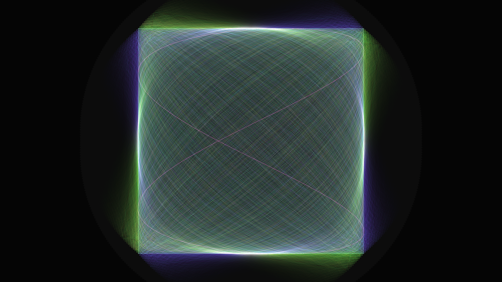

# abstract_math_lissajous_interference_web_2d

## Metadata
- **Date**: 2026-06-28
- **Theme**: Incredibly complex, dense webs of Lissajous curves that slowly rotate, stretch, and interfere with e
- **Technique**: Lissajous curves are defined by simple mathematical parametric equations: - $x = A \sin(a t + \delta)$ - $y = B \sin(b t)$  This animation draws 5 massive Lissajous figures simultaneously, each consisting of 15,000 points. Over the 15 seconds, the internal parametric frequencies $a$, $b$, and phase shifts $\delta$ subtly morph to create beautiful organic shifting and pulsing. A fast NumPy stride trick (`lines[:, 0, :] = pts[:-1]`) instantly formats the 75,000 total points into vertex coordinates so that `py5.lines()` can draw the entire massive web instantaneously.
- **Logic Lab Reference**: 

## Concept
Incredibly complex, dense webs of Lissajous curves that slowly rotate, stretch, and interfere with each other. This continuous interference creates intricate, mesmerizing optical moiré-like patterns over time.

## Technical Details
- **Renderer**: Unknown
- **Simulation**: Unknown
- **Visuals**: Unknown
- **Animation**: Contains animation details
