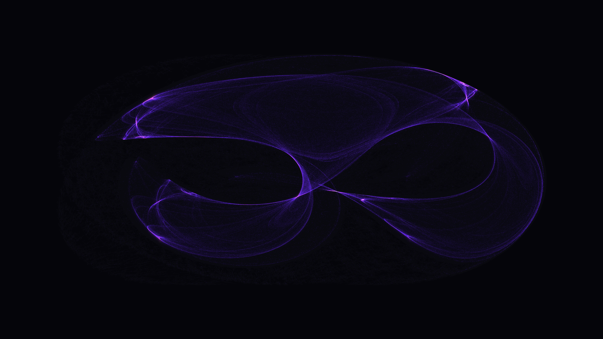

# abstract_math_strange_attractor_clifford_2d

## Metadata
- **Date**: 2026-06-28
- **Theme**: We draw an incredibly detailed Strange Attractor (specifically, the Clifford Attractor) which gradua
- **Technique**: A single Clifford attractor is drawn using the iterative equations: `x_{n+1} = sin(a * y_n) + c * cos(a * x_n)` `y_{n+1} = sin(b * x_n) + d * cos(b * y_n)`  Because drawing an attractor point-by-point in Python is too slow for 4K video, a massive parallelization technique is used. 10,000 independent particles are initialized and iterated simultaneously 30 times per frame using highly optimized vectorized NumPy arrays. This allows `py5` to draw exactly **300,000 individual points** per frame.  To animate the attractor, the fundamental mathematical parameters `a, b, c, d` subtly drift along four continuous Perlin noise loops, causing the attractor to organically fold, spread, and morph without any jagged jumps.
- **Logic Lab Reference**: 

## Concept
We draw an incredibly detailed Strange Attractor (specifically, the Clifford Attractor) which gradually and organically morphs as its mathematical parameters drift.

## Technical Details
- **Renderer**: Unknown
- **Simulation**: Unknown
- **Visuals**: Unknown
- **Animation**: Contains animation details
