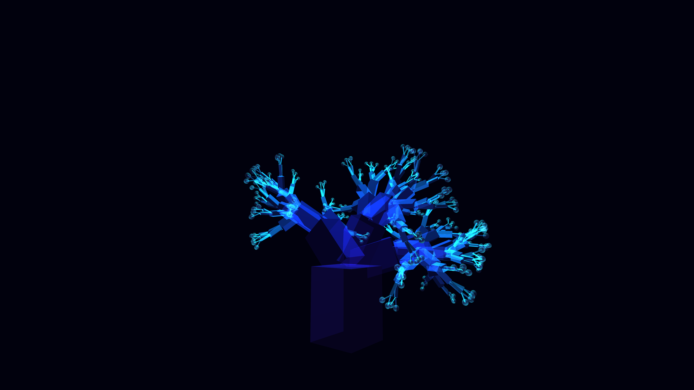

# abstract_mycelial_network_growth_3d

An animated 15s sequence of a generative 3D simulation of a growing mycelial network. The branches organically extend and subdivide over time, glowing with bio-luminescent cyan energy at their tips.

- **Theme**: A 3D representation of mycelial networks growing and branching outward, lighting up with bio-luminescent pulses.
- **Technique**: A recursive branching structure using py5's 3D capabilities. The branches grow outward over time (based on frame count) and the tips emit a soft glowing light using an attached particle system and animated sphere rendering.

