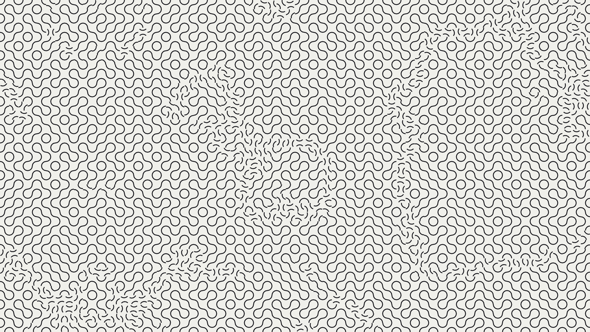

# abstract_optical_illusion_truchet_tiles_2d

## Metadata
- **Date**: 2026-06-28
- **Theme**: An optical illusion of constantly shifting mazes and loops
- **Technique**: The 4K canvas is filled with over 2,000 Truchet tiles (arcs on an invisible square grid). Rather than rotating them randomly, their rotation angles are smoothly driven by a seamless 2D spatial Perlin noise loop. When `py5.noise()` evaluates between certain thresholds, the tile snaps its rotation by 90-degree increments. To add dynamic kinetic energy to the piece, a "smooth flip" animation is implemented using a Smoothstep ease-function, making the tiles physically spin quickly into their new rotation states when the noise wave washes over them.
- **Logic Lab Reference**: 

## Concept
An optical illusion of constantly shifting mazes and loops. Thousands of individual Truchet tiles rotate dynamically to organically assemble and disassemble massive interconnected paths.

## Technical Details
- **Renderer**: Unknown
- **Simulation**: Unknown
- **Visuals**: Unknown
- **Animation**: Contains animation details
